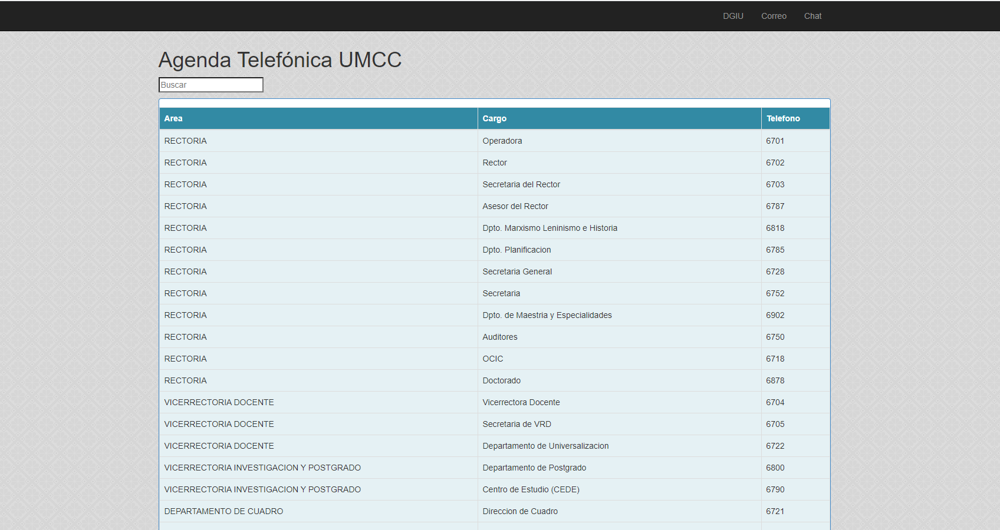

# README

Un directorio telefonico desarrollado con Angular 1.6

### Como usar la aplicacion?

- Descarga de github el proyecto
- Levanta un servidor web y apunta a la raiz y listo

### Como cambiar la base de datos?

- Solamente modifica el fichero direct.js e incorpora tus numeros telefonicos y listo

### Asi se ve mi proyecto 

##Que lo disfruten!!!
